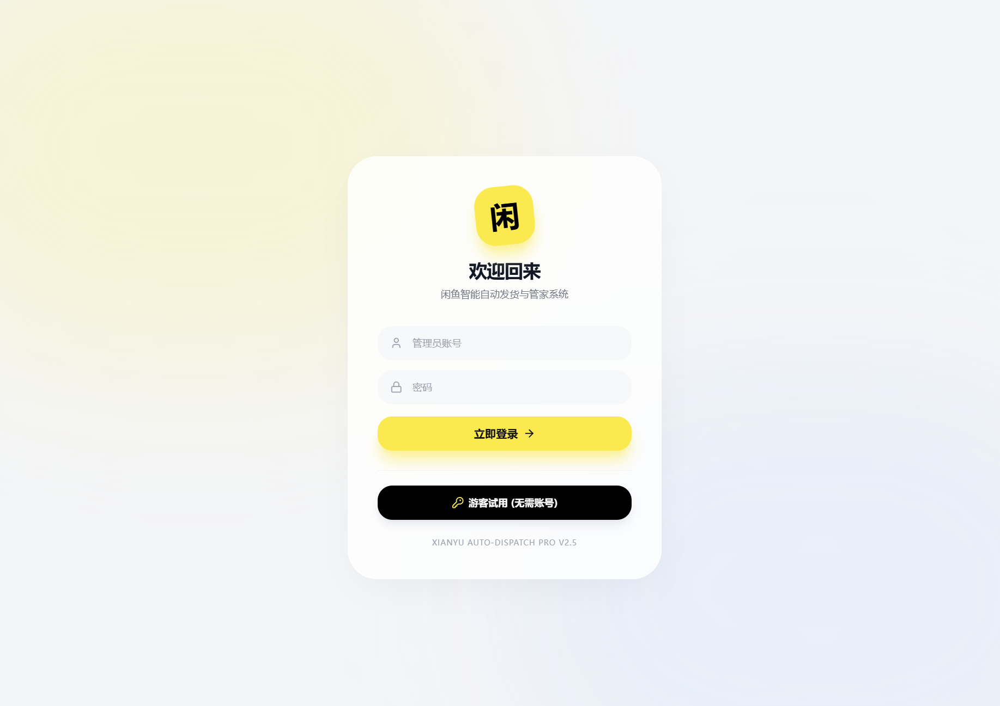
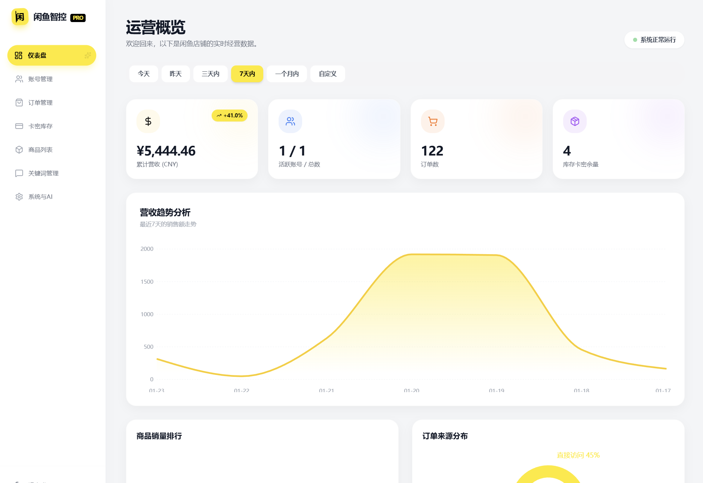
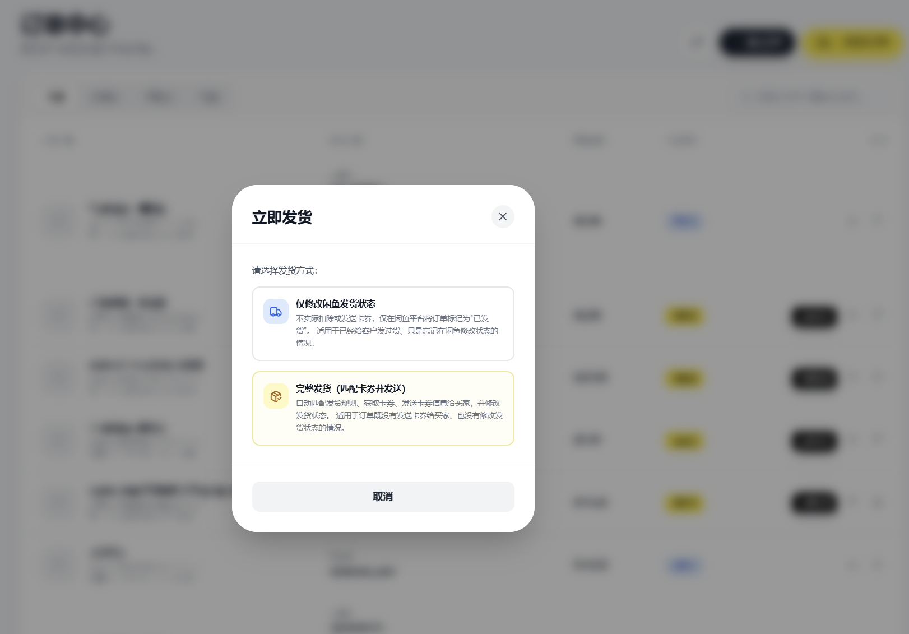

# seshi｜闲鱼助手

> 面向闲鱼店铺运营的 AI 智能发货控制台

seshi 是一个面向个人店主和小型运营团队的闲鱼工作台：把账号、商品、订单、卡密、自动回复和 AI 能力放在一条可追踪的工作流里。

它不是把功能堆在一起的后台，而是一台专注于“发现订单 → 匹配规则 → 自动发货 → AI 回复”的运营仪器。

**视觉语言：** Dark Scientific Instrument · Spectral Energy · AI Operations Console

[](https://www.python.org/)
[](https://react.dev/)
[](https://www.typescriptlang.org/)
[](https://fastapi.tiangolo.com/)

## 界面预览

### 工作台



### 订单中心



### 立即发货




## 你可以用 seshi 做什么

```text
登录闲鱼账号
      ↓
同步商品与订单
      ↓
关键词 / 商品规则匹配
      ↓
卡密、链接或图片自动发货
      ↓
AI 回复、议价与运营复盘
```

## 功能概览

### 账号与会话

- 多闲鱼账号管理与快速切换
- 支持扫码登录、密码登录和 Cookie 登录
- 账号启用状态、会话信息和 AI 议价配置

### 商品与自动发货

- 商品列表同步、搜索和分页浏览
- 卡密、链接、图片等发货资源管理
- 按商品关键词匹配发货规则
- 延时发货、多规格商品和库存资源配置

### 订单处理

- 订单同步、导入、搜索和状态筛选
- 订单详情、买家与收货信息查看
- 单条同步、批量同步和订单编辑
- 立即发货支持“仅修改发货状态”与“完整发货”两种模式

### 自动回复与 AI

- 关键词回复规则和默认回复
- 商品专属回复与账号级规则
- OpenAI 兼容接口配置
- 本地 LLM 模型发现、加载、卸载和对话测试
- AI 议价参数与系统级 AI 设置

### 运营工作台

- Dashboard 数据概览与趋势图表
- 活动流和账号状态概览
- 深色科学仪器风格的视觉系统
- 主要操作提供“蓄力 → 出勾 → 命中 → 收魂”的轻量反馈

## 技术架构

\`\`\`text
┌─────────────────────────────────────────────┐
│ React + TypeScript + Vite + Tailwind CSS    │
│ Recharts · Axios · lucide-react              │
└──────────────────────┬──────────────────────┘
                       │ REST / WebSocket
┌──────────────────────▼──────────────────────┐
│ FastAPI + Uvicorn                            │
│ 账号 · 商品 · 订单 · 卡密 · 规则 · AI       │
└──────────────────────┬──────────────────────┘
                       │
┌──────────────────────▼──────────────────────┐
│ SQLite · Playwright · Asyncio                │
│ 闲鱼会话、数据持久化与浏览器自动化           │
└─────────────────────────────────────────────┘
\`\`\`

## 快速开始

### 环境要求

- Python 3.11+
- Node.js 18+
- pnpm 9+
- Chromium（Playwright 会话需要）

### 1. 安装后端依赖

\`\`\`powershell
python -m venv .venv
.\\.venv\\Scripts\\Activate.ps1
python -m pip install --upgrade pip
pip install -r requirements.txt
playwright install chromium
\`\`\`

### 2. 安装并构建前端

\`\`\`powershell
cd frontend
pnpm install
pnpm run build
cd ..
\`\`\`

构建产物会写入项目根目录的 \`static/\`，由后端统一提供。

### 3. 启动应用

\`\`\`powershell
python Start.py
\`\`\`

打开 <http://localhost:8080>，首次使用按页面提示注册并登录。后端健康检查地址为 <http://localhost:8080/health>。

### 前端开发模式

需要修改 React 界面时，可以让后端和 Vite 分别运行：

\`\`\`powershell
# 终端 1：项目根目录
python Start.py

# 终端 2：frontend 目录
cd frontend
pnpm run dev
\`\`\`

开发服务器默认地址为 <http://localhost:3000>，API 请求会代理到 \`http://localhost:8080\`。

### Docker（可选）

\`\`\`powershell
docker compose up -d --build
\`\`\`

默认映射端口为 \`8080\`。数据库、日志和备份目录通过 Compose volume 持久化。

## 配置与数据安全

- 运行时数据库位于 \`data/\`，日志位于 \`logs/\`，这些内容不会被提交到仓库。
- 不要把 Cookie、API Key、JWT 密钥或真实买家信息写入 Git。
- 生产环境请修改管理员密码、\`JWT_SECRET_KEY\` 和其他敏感配置。
- 使用自动回复、自动发货和浏览器自动化前，请确认账号权限、数据来源及平台规则。

## 本地检查

\`\`\`powershell
cd frontend
pnpm test
pnpm exec tsc --noEmit
pnpm run build
\`\`\`

## 项目状态

当前版本聚焦于核心运营闭环：账号 → 商品/卡密 → 规则 → 订单 → 发货，以及 AI 回复与本地模型调试。视觉层使用 \`frontend/components/brand/\` 中的 \`SeshiMark\`、\`SpectralBackdrop\`、\`AICore\` 和 \`SpectralHook\` 组件统一品牌语言。

## 使用边界

这是一个个人维护的运营工具。使用自动回复、自动发货和浏览器自动化前，请确认账号权限、数据来源及闲鱼平台规则。请勿提交 Cookie、API Key、JWT 密钥或真实买家信息。

运行时数据库位于 `data/`，日志位于 `logs/`，生产环境请修改管理员密码和 `JWT_SECRET_KEY`。

## 作者

**kudokurono-creator**

[GitHub 主页](https://github.com/kudokurono-creator) · [项目仓库](https://github.com/kudokurono-creator/seshi-xianyu-helper)

<div align="center">

seshi 闲鱼助手 · AI 智能发货运营控制台

</div>
